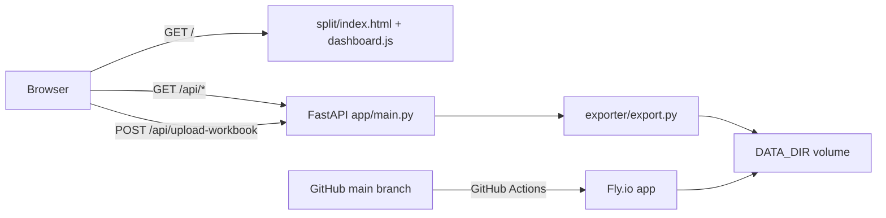

# Vitaline Inventory Tracker — System Document

> **AI / operator note:** Read this document before planning changes or deployments. Update the **Live Deployment** section after every deploy.

## Purpose

Web dashboard for Vitaline purchasing: per-office reorder needs, status tiers, item drill-down, search, vendor filters, and week history. Users can upload an updated PAR Excel workbook from the dashboard; the server regenerates persisted JSON and all users see the new data.

## Architecture



## Key paths

| Path | Role |
|------|------|
| `app/main.py` | FastAPI server, API routes, static file mount |
| `exporter/export.py` | Workbook → JSON export (shared by CLI + upload) |
| `export_dashboard_data.py` | CLI wrapper for batch export |
| `split/index.html` | Dashboard UI |
| `split/dashboard.js` | Dashboard logic + upload client |
| `split/dashboard-data.json` | Seed sample data (copied to volume on first boot) |
| `dashboard-data.schema.json` | Data contract |
| `fly.toml` | Fly.io app config |
| `Dockerfile` | Container build |
| `.github/workflows/deploy.yml` | CI/CD deploy on push to `main` |

## Data contract

Dashboard reads one JSON object (`dashboard-data.schema.json`):

- `generated` — ISO timestamp
- `controls` — booking window, snapshot date, demand basis
- `activation` — per-office Y/N
- `rows` — fixed-order 13-field arrays

Required Excel sheets: `PAR_Output`, `Office_Activation`, `Live_Controls`.

**Recalc note:** openpyxl reads cached Excel values. Save the workbook in Excel after changes before upload, or run a LibreOffice headless recalc first.

## API

| Method | Route | Description |
|--------|-------|-------------|
| GET | `/health` | Health check |
| GET | `/api/dashboard-data` | Current week JSON |
| GET | `/api/snapshots/manifest.json` | Week picker manifest |
| GET | `/api/snapshots/{YYYY-MM-DD}.json` | Historical week |
| POST | `/api/upload-workbook` | Multipart `.xlsx` upload; persists new JSON |

## Local development

```bash
cd Vitaline_Dashboard_Handoff/Vitaline_Dashboard_Handoff
python -m venv .venv
.venv\Scripts\activate          # Windows
pip install -r requirements.txt
uvicorn app.main:app --reload --port 8080
```

Open http://localhost:8080

Batch export (optional):

```bash
python export_dashboard_data.py WORKBOOK.xlsx data
```

## Deployment protocol

Use this checklist for every production deploy:

1. **Pre-deploy**
   - Read this document and confirm scope of change.
   - Run local smoke test (`/health`, `/api/dashboard-data`, dashboard renders).
   - Ensure changes are committed on `main` (or merge PR first).

2. **Deploy**
   - **CI/CD (preferred):** push to `main` → GitHub Actions runs `flyctl deploy --remote-only`.
   - **Manual fallback:** `fly deploy` from app root with Fly CLI authenticated.

3. **Post-deploy verification**
   - Open live URL; confirm dashboard loads with data.
   - Confirm week picker works if snapshots exist.
   - Confirm upload button accepts `.xlsx` (smoke test with real workbook when available).
   - Update **Live Deployment** section below with URL, date, and notes.

4. **Secrets / infra**
   - GitHub repo secret: `FLY_API_TOKEN`
   - Fly volume: `dashboard_data` mounted at `/data`
   - Env: `DATA_DIR=/data`

## Wrap-up protocol

After completing work in this repo:

1. Update this `SYSTEM.md` if architecture, routes, or ops changed.
2. Record live URL and deployment timestamp in **Live Deployment**.
3. Note any follow-ups (e.g. workbook recalc validation pending).
4. Ensure `.github/workflows/deploy.yml` still matches Fly app name in `fly.toml`.
5. Leave repo in deployable state on `main`.

## CI/CD

- **Repository:** https://github.com/anantbairagi/vitaline-inventory-tracker
- **Branch:** `main` auto-deploys via `.github/workflows/deploy.yml`
- **Required secret:** `FLY_API_TOKEN` in GitHub repo settings

## Live Deployment

| Field | Value |
|-------|-------|
| **Status** | Live |
| **Fly app** | `vitaline-inventory-tracker` |
| **Region** | `ord` |
| **Live URL** | https://vitaline-inventory-tracker.fly.dev/ |
| **GitHub** | https://github.com/anantbairagi/vitaline-inventory-tracker |
| **Last deployed** | 2026-06-23 (initial deploy) |
| **Deployed by** | Cursor agent (local `fly deploy`) |
| **Notes** | First boot seeds sample data from `split/` if volume is empty. CI/CD secret `FLY_API_TOKEN` configured on GitHub. Volume `dashboard_data` (1 GB) mounted at `/data`. VM memory 1024 MB for large workbook uploads. Exporter uses openpyxl read-only streaming to avoid OOM. |

## Troubleshooting

| Issue | Fix |
|-------|-----|
| Upload fails "Expected sheet not found" | Workbook missing required sheets |
| Stale numbers after upload | Re-save workbook in Excel before upload |
| Empty dashboard on first deploy | Volume seeds from bundled sample on startup |
| CI deploy fails | Check `FLY_API_TOKEN` secret and Fly app exists |
